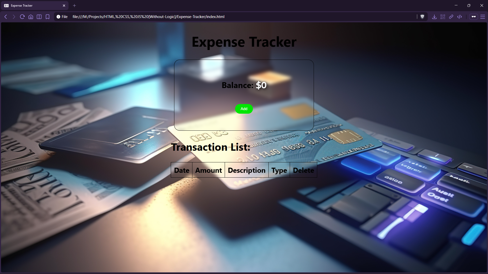

# Expense Tracker


A responsive expense tracker that lets you add **Budget** and **Expense** transactions, computes the balance instantly, and renders entries into a table with delete actions.

## Preview



## Live Demo

[Expense Tracker](https://mullaivenese03.github.io/HTML-CSS-JS-Without-Logic/Expense-Tracker/)

## Features

- **Add transactions** with date, amount, description, and type (Budget/Expense).
- **Client-side validation** for required inputs before creating a transaction.
- **Real-time balance** updates (budget adds, expense subtracts).
- **Color-coded balance**: green for positive, red when negative.
- **Transaction table rendering** using dynamic `<tr>` creation.
- **Delete transaction** by removing the row from the table.

## Technologies Used

- HTML5
- CSS3
- JavaScript (DOM manipulation + events)

## Project Structure

```text
Expense-Tracker/
├─ index.html
├─ style.css
├─ script.js
├─ Assets/
│  ├─ Icons/
│  └─ Images/
└─ Preview_Image-*.png
```

## What I Learned

- **HTML**: designing form-like inputs (date/number/text/radio) that map cleanly to app state.
- **CSS**: building a glassy UI using `backdrop-filter`, responsive widths, and table styling.
- **JavaScript**: input validation, dynamic row creation, simple state management with variables, and event-driven UI updates.
- **UI/UX**: using visual feedback (balance color) to make status obvious instantly.
- **Architecture**: separating display logic (DOM) from state updates (balance variable + computed rules).

## Challenges Faced

- **Validation edge cases**: ensuring the app doesn’t create partial/invalid transactions.
- **Keeping balance correct**: applying the right math based on selected radio button type.
- **Delete behavior**: removing the right entry without breaking the rest of the table.
- **Responsive tables**: maintaining readability on smaller screens.

## How I Solved Them

- **Validation**: checked empty inputs + radio selection before proceeding; otherwise blocked with `alert`.
- **Type handling**: derived a `radioBtn` label and updated balance based on `expenseRadio.checked`.
- **Delete**: attached an inline delete handler that removes the row via `event.target.parentNode.remove()`.
- **Responsive UI**: used media queries to reduce font size and adjust layout for narrow widths.

## Future Improvements

- Persist transactions using **Local Storage** (restore on refresh).
- Add summary cards for **Total Budget** and **Total Expense**.
- Add categories + filtering (e.g., Food, Travel, Rent).
- Replace `alert()` with inline validation messages and better UX.
- Add charts (monthly spend breakdown) using a small chart library.

## Installation

```bash
git clone https://github.com/MullaiVenese03/HTML-CSS-JS-Without-Logic.git
cd "HTML-CSS-JS-Without-Logic/Expense-Tracker"
```

Open `index.html` in your browser.

## Author

- Mullai Venese - [MullaiVenese03](https://github.com/MullaiVenese03/)
- Repository: [HTML-CSS-JS-Without-Logic](https://github.com/MullaiVenese03/HTML-CSS-JS-Without-Logic)
