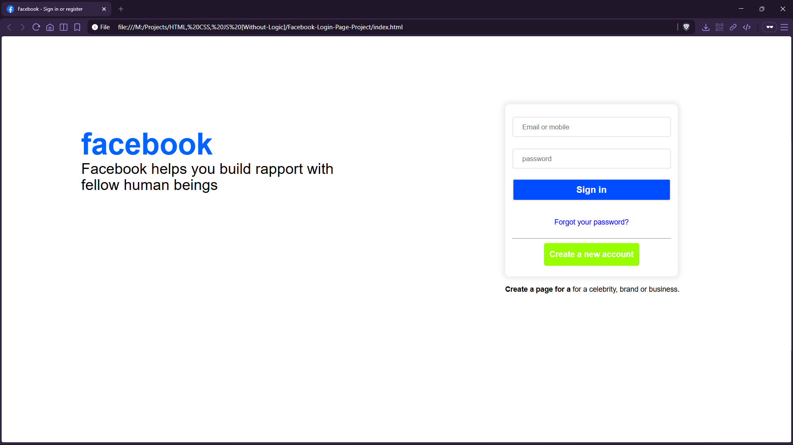

# Facebook Login Page (UI Clone)


A static UI clone of Facebook’s login page layout, focused on typography, spacing, and card-style form presentation.

## Preview



## Live Demo

[Facebook Login Page](https://mullaivenese03.github.io/HTML-CSS-JS-Without-Logic/Facebook-Login-Page-Project/)

## Features

- **Two-column hero layout** with branding on the left and a login card on the right.
- **Form UI** with email/phone input, password input, and primary/secondary buttons.
- **Visual hierarchy** using spacing, shadows, and button colors similar to the original.
- **Simple, readable CSS** built from scratch without frameworks.

## Technologies Used

- HTML5
- CSS3

## Project Structure

```text
Facebook-Login-Page-Project/
├─ index.html
├─ facebook.css
└─ Preview-Image.png
```

## What I Learned

- **HTML**: building a recognizable authentication layout using basic form elements.
- **CSS**: recreating a real-world design with box shadows, spacing, and alignment.
- **UI/UX**: using color and size to communicate primary vs secondary actions.
- **Architecture**: keeping the clone maintainable by styling through IDs/classes with clear intent.

## Challenges Faced

- **Alignment**: positioning two major sections (branding + login card) without a layout framework.
- **Consistent spacing**: matching familiar “Facebook-like” paddings and sizes.
- **Responsiveness**: maintaining usability across different screen widths.

## How I Solved Them

- Used **inline-block + float** positioning in CSS to place sections side-by-side.
- Applied a **card shadow** and fixed sizing for the login box to keep it visually consistent.
- Kept typography and spacing uniform via shared font settings and line-height.

## Future Improvements

- Refactor layout to flexbox/grid for easier responsiveness.
- Add mobile breakpoints for a stacked layout.
- Add basic client-side validation messages (still UI-only).

## Installation

```bash
git clone https://github.com/MullaiVenese03/HTML-CSS-JS-Without-Logic.git
cd "HTML-CSS-JS-Without-Logic/Facebook-Login-Page-Project"
```

Open `index.html` in your browser.

## Author

- Mullai Venese - [MullaiVenese03](https://github.com/MullaiVenese03/)
- Repository: [HTML-CSS-JS-Without-Logic](https://github.com/MullaiVenese03/HTML-CSS-JS-Without-Logic)
