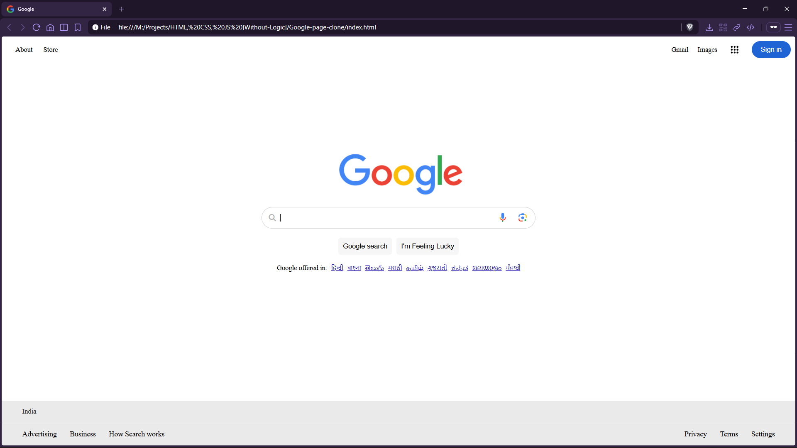

# Google Page Clone


A responsive UI clone of the Google Search homepage focused on layout accuracy, spacing, and interactive hover/focus styling (no backend search behavior).

## Preview



## Live Demo

[Google Page Clone](https://mullaivenese03.github.io/HTML-CSS-JS-Without-Logic/Google-page-clone/)

## Features

- **Header layout** with left/right navigation links, app-grid icon, and sign-in button styling.
- **Search bar UI** with icons and realistic spacing/hover shadow.
- **Buttons section** matching Google-style pill buttons.
- **Language links** section with hover underline behavior.
- **Footer layout** with responsive stacking on smaller screens.
- **Auto focus** on the search input on page load (small inline script).

## Technologies Used

- HTML5
- CSS3 (flexbox, responsive media queries)
- JavaScript (tiny inline script for input focus)

## Project Structure

```text
Google-page-clone/
├─ index.html
├─ style.css
└─ Preview-Image.png
```

## What I Learned

- **HTML**: building complex page structure (header/section/footer) with clean nesting.
- **CSS**: recreating real-world UI spacing using flexbox, hover states, and subtle shadows.
- **JavaScript**: small progressive enhancements (autofocus) without changing core behavior.
- **UI/UX**: balancing fidelity and responsiveness (desktop layout that still reads well on mobile).
- **Architecture**: keeping the clone maintainable by styling through classes and predictable containers.

## Challenges Faced

- **Pixel-level spacing**: matching the feel of Google’s layout without overcomplicating CSS.
- **Responsive behavior**: adapting the central layout and footer links to small screens.
- **Hover/active states**: making the UI feel interactive even without backend functionality.

## How I Solved Them

- Used a **centered container** for the hero section and controlled width with responsive rules.
- Applied **media queries** for 768px and 480px to adjust layout, spacing, and footer stacking.
- Added **hover effects** (shadows/underlines) to match real UI feedback patterns.

## Future Improvements

- Add dark mode styling toggle.
- Add keyboard shortcuts (focus search with `/`).
- Replace inline icons with local SVGs for offline friendliness.
- Improve accessibility (aria labels for icons, better focus rings).

## Installation

```bash
git clone https://github.com/MullaiVenese03/HTML-CSS-JS-Without-Logic.git
cd "HTML-CSS-JS-Without-Logic/Google-page-clone"
```

Open `index.html` in your browser.

## Author

- Mullai Venese - [MullaiVenese03](https://github.com/MullaiVenese03/)
- Repository: [HTML-CSS-JS-Without-Logic](https://github.com/MullaiVenese03/HTML-CSS-JS-Without-Logic)
