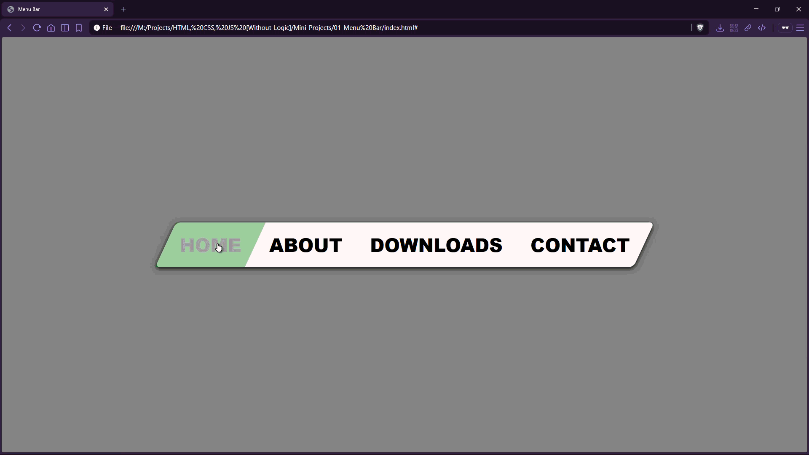

# Menu Bar


A clean navigation menu with a bold **skewed (slanted) UI** and hover highlight effects—built using only HTML and CSS.

## Preview



## Live Demo

[Menu Bar](https://mullaivenese03.github.io/HTML-CSS-JS-Without-Logic/Mini-Projects/01-Menu%20Bar/)

## Features

- **Skewed navigation container** using `transform: skew(...)` for a distinctive look.
- **Hover highlight** on each menu item with background color change.
- **Readable typography** with uppercase links and strong font weight.
- **Centered layout** using flexbox to keep the nav in the middle of the screen.

## Technologies Used

- HTML5
- CSS3

## Project Structure

```text
01-Menu Bar/
├─ index.html
├─ style.css
└─ Preview-Gif.gif
```

## What I Learned

- **HTML**: building a semantic nav using `<nav>`, `<ul>`, and `<a>`.
- **CSS**: combining transforms (skew parent + unskew children) to keep text readable.
- **UI/UX**: using simple hover feedback to improve discoverability.

## Challenges Faced

- **Skewed layout readability**: skewing the container can skew the text too.
- **Hover states**: keeping hover transitions smooth without feeling “jumpy”.

## How I Solved Them

- **Counter-skewed text**: applied skew to the `<ul>` and an opposite skew to the `<a>` elements.
- **Consistent hover**: used a simple background swap and color change for predictable feedback.

## Future Improvements

- Add active/selected state and focus-visible styling for accessibility.
- Convert to a responsive hamburger menu for mobile screens.

## Installation

```bash
git clone https://github.com/MullaiVenese03/HTML-CSS-JS-Without-Logic.git
cd "HTML-CSS-JS-Without-Logic/Mini-Projects/01-Menu Bar"
```

Open `index.html` in your browser.

## Author

- Mullai Venese - [MullaiVenese03](https://github.com/MullaiVenese03/)
- Repository: [HTML-CSS-JS-Without-Logic](https://github.com/MullaiVenese03/HTML-CSS-JS-Without-Logic)

