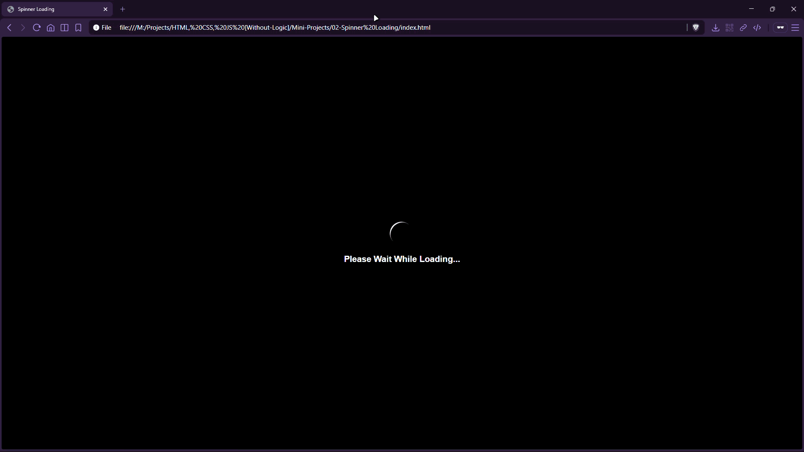

# Spinner Loading


A minimal loader component featuring a rotating spinner and a loading message—built with pure CSS keyframes.

## Preview



## Live Demo

[Spinner Loading](https://mullaivenese03.github.io/HTML-CSS-JS-Without-Logic/Mini-Projects/02-Spinner%20Loading/)

## Features

- **CSS-only spinner** using a bordered circle and `@keyframes` rotation.
- **Centered layout** with flexbox for perfect vertical/horizontal alignment.
- **Reusable loader** pattern suitable for page or data loading states.

## Technologies Used

- HTML5
- CSS3 (keyframes animation)

## Project Structure

```text
02-Spinner Loading/
├─ index.html
├─ style.css
└─ Preview-Gif.gif
```

## What I Learned

- **HTML**: keeping structure minimal for a component-style UI.
- **CSS**: creating motion with keyframes and controlling timing with `linear` and `infinite`.
- **UI/UX**: pairing motion + text to communicate “loading” clearly.

## Challenges Faced

- **Smooth rotation**: avoiding uneven motion that can look choppy.
- **Visual balance**: keeping the spinner and text aligned and readable.

## How I Solved Them

- Used a **linear infinite** keyframe animation for steady rotation.
- Centered content with **flexbox** and tuned spacing with margins.

## Future Improvements

- Add size variants and color themes.
- Add accessibility improvements (reduced motion preference, ARIA label for screen readers).

## Installation

```bash
git clone https://github.com/MullaiVenese03/HTML-CSS-JS-Without-Logic.git
cd "HTML-CSS-JS-Without-Logic/Mini-Projects/02-Spinner Loading"
```

Open `index.html` in your browser.

## Author

- Mullai Venese - [MullaiVenese03](https://github.com/MullaiVenese03/)
- Repository: [HTML-CSS-JS-Without-Logic](https://github.com/MullaiVenese03/HTML-CSS-JS-Without-Logic)

