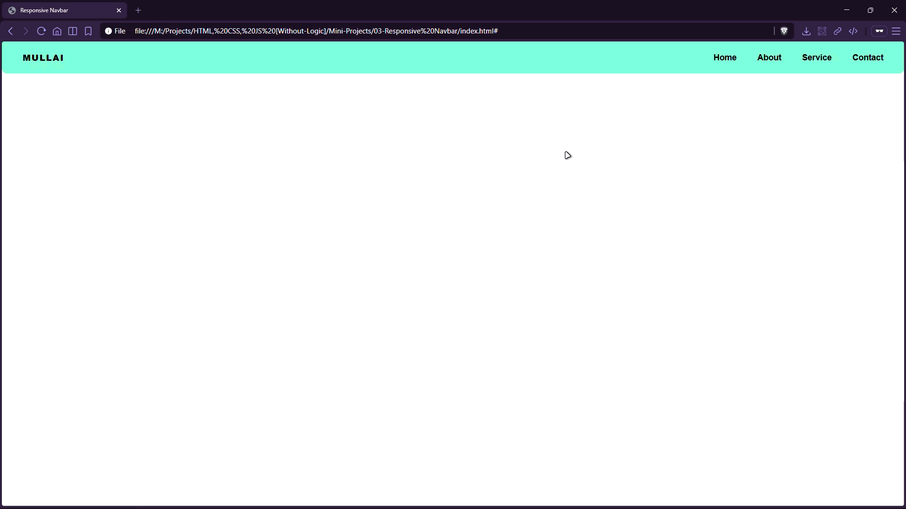

# Responsive Navbar


A responsive navigation bar that adapts from a horizontal layout to stacked navigation for smaller screens using CSS media queries.

## Preview



## Live Demo

[Responsive Navbar](https://mullaivenese03.github.io/HTML-CSS-JS-Without-Logic/Mini-Projects/03-Responsive%20Navbar/)

## Features

- **Desktop layout**: logo on the left and horizontal nav links on the right.
- **Mobile layout (≤ 600px)**: navbar stacks vertically (logo above links).
- **Small-screen layout (≤ 400px)**: links become a vertical list for easier tapping.
- **Clean hover feedback** with underline on links.

## Technologies Used

- HTML5
- CSS3 (flexbox + media queries)

## Project Structure

```text
03-Responsive Navbar/
├─ index.html
├─ style.css
└─ Preview-Gif.gif
```

## What I Learned

- **HTML**: structuring navigation content cleanly using lists and anchor links.
- **CSS**: using flexbox for layout and media queries for responsive breakpoints.
- **UI/UX**: making navigation easier to read and tap on smaller screens.

## Challenges Faced

- **Breakpoint planning**: choosing sizes where the layout should switch.
- **Spacing on mobile**: keeping links readable without overcrowding.

## How I Solved Them

- Added two targeted breakpoints (600px and 400px) to progressively simplify layout.
- Switched flex direction and alignment rules to keep the design balanced.

## Future Improvements

- Add a hamburger toggle with JavaScript for a true collapsible menu.
- Add active state styling and focus-visible outlines for accessibility.

## Installation

```bash
git clone https://github.com/MullaiVenese03/HTML-CSS-JS-Without-Logic.git
cd "HTML-CSS-JS-Without-Logic/Mini-Projects/03-Responsive Navbar"
```

Open `index.html` in your browser.

## Author

- Mullai Venese - [MullaiVenese03](https://github.com/MullaiVenese03/)
- Repository: [HTML-CSS-JS-Without-Logic](https://github.com/MullaiVenese03/HTML-CSS-JS-Without-Logic)

