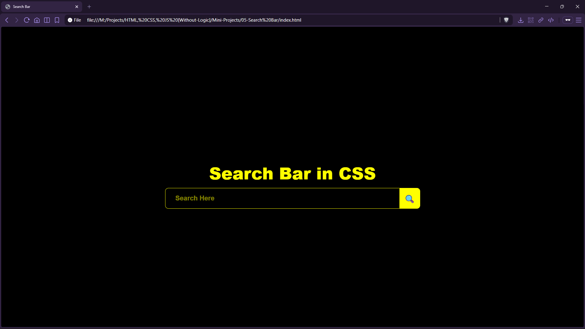

# Search Bar


A bold, high-contrast search bar UI component with a matching icon button—built using HTML and CSS.

## Preview



## Live Demo

[Search Bar](https://mullaivenese03.github.io/HTML-CSS-JS-Without-Logic/Mini-Projects/05-Search%20Bar/)

## Features

- **Large input field** with placeholder styling for visibility.
- **Icon button** aligned to the right with matching border radius.
- **High contrast theme** (yellow on black) for a strong visual identity.

## Technologies Used

- HTML5
- CSS3

## Project Structure

```text
05-Search Bar/
├─ index.html
├─ style.css
└─ Preview-Image.png
```

## What I Learned

- **HTML**: building a simple component with an input + button pairing.
- **CSS**: aligning elements with border-radius continuity to form a single unified control.
- **UI/UX**: using contrast and sizing to keep the component readable and obvious.

## Challenges Faced

- **Button alignment**: keeping the button visually attached to the input.
- **Consistent sizing**: matching input height and button height.

## How I Solved Them

- Used complementary border-radius values (left for input, right for button).
- Tuned padding and height so both controls align cleanly.

## Future Improvements

- Add hover/focus states and an accessible focus ring.
- Add actual search behavior (filter list, call API, or redirect).
- Make the width responsive (fluid input) for small screens.

## Installation

```bash
git clone https://github.com/MullaiVenese03/HTML-CSS-JS-Without-Logic.git
cd "HTML-CSS-JS-Without-Logic/Mini-Projects/05-Search Bar"
```

Open `index.html` in your browser.

## Author

- Mullai Venese - [MullaiVenese03](https://github.com/MullaiVenese03/)
- Repository: [HTML-CSS-JS-Without-Logic](https://github.com/MullaiVenese03/HTML-CSS-JS-Without-Logic)

