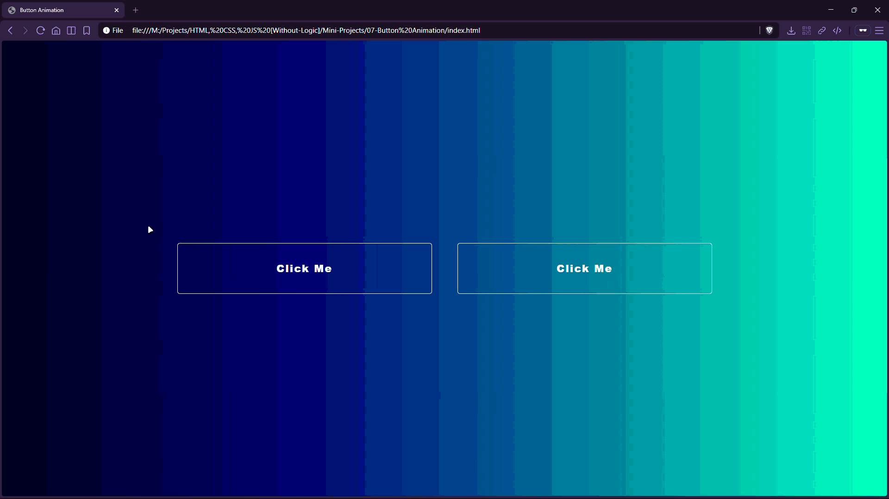

# Button Animation


Two hover-animated buttons with a “fill” layer effect created using an absolutely positioned element and a width transition.

## Preview



## Live Demo

[Button Animation](https://mullaivenese03.github.io/HTML-CSS-JS-Without-Logic/Mini-Projects/07-Button%20Animation/)

## Features

- **Layered hover fill**: a `.layer` span expands from 0% → 100% width on hover.
- **Smooth transition** using `transition: 0.5s`.
- **Contrast flip**: text color changes from white → black when the background layer fills.
- **Centered layout** with a gradient background and spacing between buttons.

## Technologies Used

- HTML5
- CSS3 (transitions, positioning)

## Project Structure

```text
07-Button Animation/
├─ index.html
├─ style.css
└─ Preview-Gif.gif
```

## What I Learned

- **HTML**: creating reusable button markup with a dedicated internal layer element.
- **CSS**: using absolute positioning + `z-index` to place an animated background behind text.
- **UI/UX**: making hover interactions feel responsive and satisfying with minimal code.

## Challenges Faced

- **Layer stacking**: keeping the fill layer behind the button label.
- **Edge alignment**: matching the layer border radius to the button’s radius.

## How I Solved Them

- Positioned the layer absolutely and sent it behind using a negative z-index.
- Applied the same border radius to both button and layer for a clean fill edge.

## Future Improvements

- Add focus-visible styles for keyboard navigation.
- Add different animation directions (left-to-right, center-out, diagonal).

## Installation

```bash
git clone https://github.com/MullaiVenese03/HTML-CSS-JS-Without-Logic.git
cd "HTML-CSS-JS-Without-Logic/Mini-Projects/07-Button Animation"
```

Open `index.html` in your browser.

## Author

- Mullai Venese - [MullaiVenese03](https://github.com/MullaiVenese03/)
- Repository: [HTML-CSS-JS-Without-Logic](https://github.com/MullaiVenese03/HTML-CSS-JS-Without-Logic)

