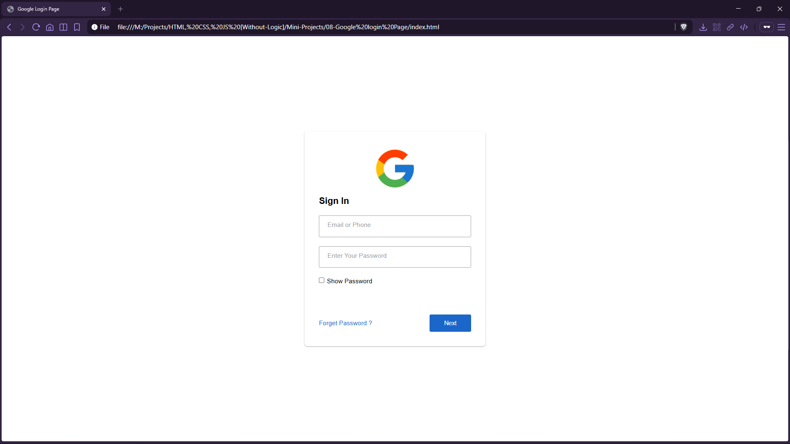

# Google Login Page (UI Clone)


A clean UI clone inspired by Google’s sign-in form, featuring floating labels, input focus states, and a modern card layout.

## Preview



## Live Demo

[Google Login Page](https://mullaivenese03.github.io/HTML-CSS-JS-Without-Logic/Mini-Projects/08-Google%20login%20Page/)

## Features

- **Floating label inputs** using `:focus + label` and `:valid + label` techniques.
- **Card-style form** with shadow and clean spacing.
- **Focus styling** that matches common modern form UX.
- **“Show password” checkbox UI** (visual only; no JS toggle behavior in this version).

## Technologies Used

- HTML5
- CSS3 (positioning, transitions)

## Project Structure

```text
08-Google login Page/
├─ index.html
├─ style.css
└─ Preview-Image.png
```

## What I Learned

- **HTML**: building form groups that support label animations.
- **CSS**: creating floating labels with absolute positioning and smooth transitions.
- **UI/UX**: improving form clarity with focus states and consistent spacing.

## Challenges Faced

- **Label overlap**: preventing the label from colliding with the typed text.
- **State handling**: keeping the label “floating” after the user enters a value.

## How I Solved Them

- Moved the label upward on focus and used `background-color: white` to avoid overlap.
- Used `:not(:focus):valid + label` so the label stays floated when the input has content.

## Future Improvements

- Add JavaScript to toggle password visibility via the checkbox.
- Add validation messages and better accessibility (aria labels).
- Add responsive tweaks for very small screens.

## Installation

```bash
git clone https://github.com/MullaiVenese03/HTML-CSS-JS-Without-Logic.git
cd "HTML-CSS-JS-Without-Logic/Mini-Projects/08-Google login Page"
```

Open `index.html` in your browser.

## Author

- Mullai Venese - [MullaiVenese03](https://github.com/MullaiVenese03/)
- Repository: [HTML-CSS-JS-Without-Logic](https://github.com/MullaiVenese03/HTML-CSS-JS-Without-Logic)

