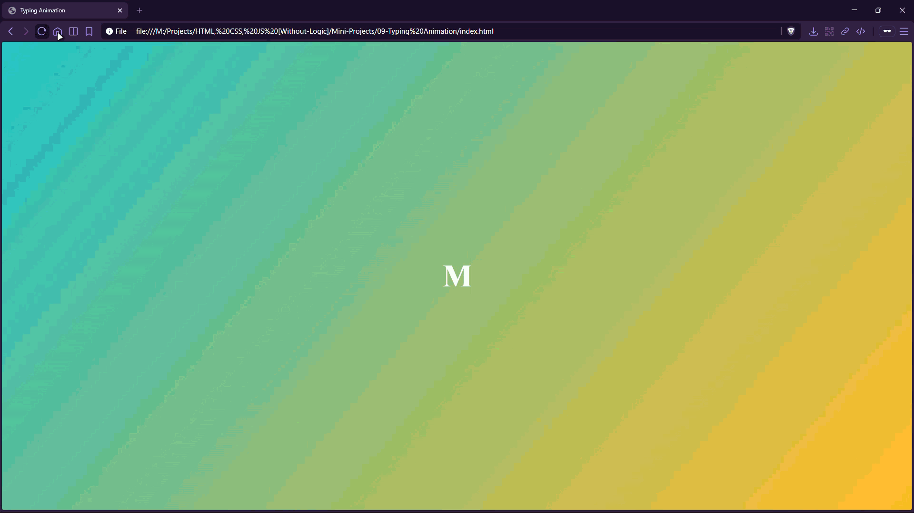

# Typing Animation


A CSS typing effect that animates the width of a headline in “steps” while showing a blinking cursor-style border.

## Preview



## Live Demo

[Typing Animation](https://mullaivenese03.github.io/HTML-CSS-JS-Without-Logic/Mini-Projects/09-Typing%20Animation/)

## Features

- **Typing effect** using `steps(...)` timing for character-by-character reveals.
- **Cursor effect** with `border-right` on the text.
- **Gradient background** with centered typography.
- **Infinite loop** animation for continuous showcasing.

## Technologies Used

- HTML5
- CSS3 (keyframes, steps timing function)

## Project Structure

```text
09-Typing Animation/
├─ index.html
├─ style.css
└─ Preview-Gif.gif
```

## What I Learned

- **CSS animations**: animating `width` with a `steps()` timing function to mimic typing.
- **Text layout**: using `white-space: nowrap` + `overflow: hidden` for clean clipping.
- **UI/UX**: adding a cursor line for better “typing” realism.

## Challenges Faced

- **Getting the character count right**: matching the `ch` width to the actual text length.
- **Maintaining smoothness**: keeping the animation readable at different speeds.

## How I Solved Them

- Tuned the steps count and `ch` width to match the headline.
- Used a longer duration (8s) so the animation remains easy to follow.

## Future Improvements

- Add a blinking cursor animation.
- Make text responsive (scale down on small screens).
- Add multiple phrases and cycle through them.

## Installation

```bash
git clone https://github.com/MullaiVenese03/HTML-CSS-JS-Without-Logic.git
cd "HTML-CSS-JS-Without-Logic/Mini-Projects/09-Typing Animation"
```

Open `index.html` in your browser.

## Author

- Mullai Venese - [MullaiVenese03](https://github.com/MullaiVenese03/)
- Repository: [HTML-CSS-JS-Without-Logic](https://github.com/MullaiVenese03/HTML-CSS-JS-Without-Logic)

