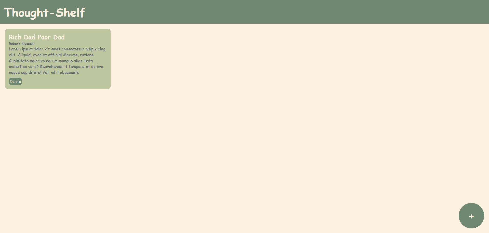

# Thought Shelf App


A mini “book thoughts” app where you can add a book title, author, and short description into card-like entries, then delete them anytime—all built with vanilla DOM manipulation.

## Preview



## Live Demo

[Thought Shelf App](https://mullaivenese03.github.io/HTML-CSS-JS-Without-Logic/Thought-Shelf-App/)

## Features

- **Overlay add form** triggered by a floating “+” action button.
- **Create thought cards** dynamically with title, author, and description.
- **Delete cards** instantly using a delete button inside each card.
- **Modal-style UX**: overlay blocks the background while adding a new entry.
- **Responsive card layout**: cards flow full-width on mobile and become multi-column on larger screens.

## Technologies Used

- HTML5
- CSS3 (responsive breakpoints)
- JavaScript (DOM manipulation + events)

## Project Structure

```text
Thought-Shelf-App/
├─ index.html
├─ style.css
├─ script.js
└─ Preview_Image-*.png
```

## What I Learned

- **HTML**: designing a simple modal form with inputs + textarea that map to a card layout.
- **CSS**: creating an overlay effect with stacking (`z-index`) and responsive “card grid” behavior.
- **JavaScript**: dynamically creating elements, injecting markup safely, and updating the DOM without frameworks.
- **UI/UX**: building a clear add/cancel flow and keeping the primary action accessible via a floating button.
- **Architecture**: separating the overlay state (show/hide) from list rendering (append card).

## Challenges Faced

- **Overlay layering**: ensuring the modal always stays above cards and is centered.
- **Form submission behavior**: preventing page refresh when clicking form buttons.
- **Dynamic delete**: removing the correct card without needing complex identifiers.
- **Responsive layout**: keeping cards readable while increasing columns on larger screens.

## How I Solved Them

- **Layering**: used absolute positioning + `z-index` to control overlay and background.
- **Prevent default**: used `event.preventDefault()` for add/cancel to keep SPA behavior.
- **Delete**: removed the card with `event.target.parentElement.remove()`.
- **Responsiveness**: adjusted `.container-content` widths at 768px and 1024px breakpoints.

## Future Improvements

- Persist entries using **Local Storage** (so the shelf survives refresh).
- Add edit mode for existing cards.
- Add search/filter by author or title.
- Add character count feedback and better validation (required fields + inline messages).

## Installation

```bash
git clone https://github.com/MullaiVenese03/HTML-CSS-JS-Without-Logic.git
cd "HTML-CSS-JS-Without-Logic/Thought-Shelf-App"
```

Open `index.html` in your browser.

## Author

- Mullai Venese - [MullaiVenese03](https://github.com/MullaiVenese03/)
- Repository: [HTML-CSS-JS-Without-Logic](https://github.com/MullaiVenese03/HTML-CSS-JS-Without-Logic)
