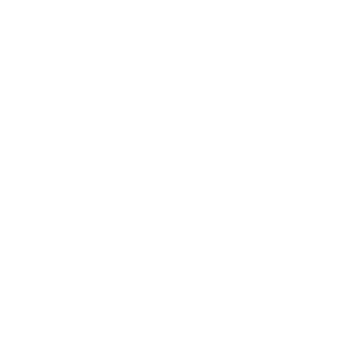

# To-Do List


A simple to-do list app built with vanilla JavaScript that supports adding tasks (Enter or button), marking them complete, auto-removing completed items, and clearing the entire list.

## Preview



## Live Demo

[To-Do List](https://mullaivenese03.github.io/HTML-CSS-JS-Without-Logic/To-Do-List/)

## Features

- **Add tasks** using the Enter key or the add button.
- **Instant DOM rendering**: tasks appear immediately as list items.
- **Complete on click**: clicking a task strikes it through, shows a completion alert, then removes it.
- **Clear all tasks** with one button.
- **Responsive layout** using CSS grid + media queries for different screen sizes.

## Technologies Used

- HTML5
- CSS3
- JavaScript

## Project Structure

```text
To-Do-List/
├─ index.html
├─ style.css
├─ script.js
└─ Assets/
   └─ Icons/
```

## What I Learned

- **HTML**: building a minimal, form-like UI with accessible inputs and buttons.
- **CSS**: creating a glassmorphism-style container and adapting the task grid across breakpoints.
- **JavaScript**: event handling (click + keyboard), dynamic element creation, and timed behavior (`setTimeout`).
- **UI/UX**: small feedback loops (strike-through + confirmation + auto-remove) to reinforce task completion.
- **Architecture**: keeping the app lightweight by using DOM as the source of truth for the current task list.

## Challenges Faced

- **Keyboard handling**: reliably capturing Enter to create tasks.
- **Task lifecycle**: updating styles, notifying the user, and removing items without glitches.
- **Responsive list layout**: ensuring long tasks wrap well and the grid remains readable.

## How I Solved Them

- **Enter-to-add**: listened for a `keydown` event and triggered the same add function as the button.
- **Completion flow**: applied `textDecoration`, then removed the element after a short delay.
- **Responsive CSS**: switched the grid from 3 columns → 2 → 1 using media queries and `word-break` rules.

## Future Improvements

- Save tasks to **Local Storage** so they persist after refresh.
- Add “edit task” and “undo delete” actions.
- Replace `alert()` with inline toast notifications.
- Add task priorities and due dates.

## Installation

```bash
git clone https://github.com/MullaiVenese03/HTML-CSS-JS-Without-Logic.git
cd "HTML-CSS-JS-Without-Logic/To-Do-List"
```

Open `index.html` in your browser.

## Author

- Mullai Venese - [MullaiVenese03](https://github.com/MullaiVenese03/)
- Repository: [HTML-CSS-JS-Without-Logic](https://github.com/MullaiVenese03/HTML-CSS-JS-Without-Logic)
