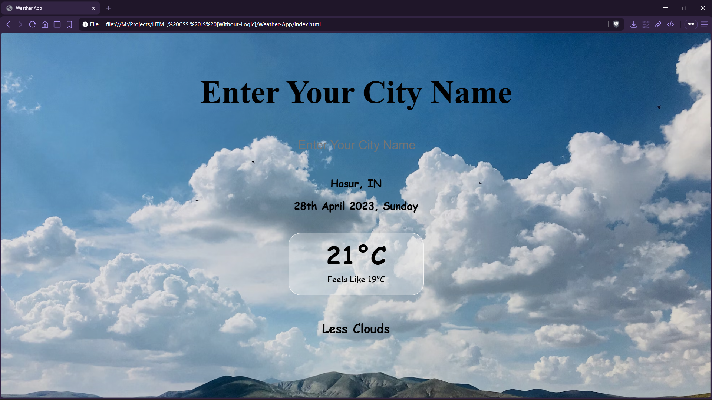

# Weather App


A lightweight weather UI that fetches **live city weather** from OpenWeather and updates the background based on temperature.

## Preview



## Live Demo

[Weather App](https://mullaivenese03.github.io/HTML-CSS-JS-Without-Logic/Weather-App/)

## Features

- **City-based weather lookup** using OpenWeather’s current weather endpoint.
- **Temperature + “feels like” display** in metric units (°C).
- **Dynamic background** that switches images by temperature range.
- **Basic error handling**: shows “NO CITY FOUND” for invalid locations (404).
- **Readable date UI** derived from the API timestamp and timezone offset.

## Technologies Used

- HTML5
- CSS3
- JavaScript (Fetch API)
- OpenWeather API (`/data/2.5/weather`)

## Project Structure

```text
Weather-App/
├─ index.html
├─ style.css
├─ script.js
└─ Preview_Image-*.png
```

## What I Learned

- **HTML**: structuring a small single-page UI with clear IDs for JS targeting.
- **CSS**: building a simple glass-card feel with borders, transparency, and focus styling.
- **JavaScript**: async `fetch`, parsing JSON, updating text content, and DOM event handling.
- **UI/UX**: improving clarity with background changes that communicate “cold/warm/hot” at a glance.
- **Architecture**: separating concerns (layout in HTML, styling in CSS, behavior in JS).

## Challenges Faced

- **API error responses**: handling invalid city names and empty states cleanly.
- **Timezone + date formatting**: turning `dt` and `timezone` offsets into a readable day/month/year string.
- **Visual consistency**: ensuring background images remain readable behind text on different screens.

## How I Solved Them

- **Error states**: checked `response.cod` and cleared UI fields when the API returns `404`.
- **Date formatting**: derived a JS `Date` from API seconds and adjusted by the timezone offset before formatting.
- **Readability**: used a slightly dimmed backdrop (`backdrop-filter` + translucent containers) to keep text legible.

## Future Improvements

- Move the API key to a safer approach (server proxy or environment-based build).
- Add loading + network error states (offline, rate-limit, invalid API key).
- Display more metrics (humidity, wind speed) and icons for weather conditions.
- Add “search on input debounce” instead of only on change, plus a search button.

## Installation

```bash
git clone https://github.com/MullaiVenese03/HTML-CSS-JS-Without-Logic.git
cd "HTML-CSS-JS-Without-Logic/Weather-App"
```

Open `index.html` in your browser.

## Author

- Mullai Venese - [MullaiVenese03](https://github.com/MullaiVenese03/)
- Repository: [HTML-CSS-JS-Without-Logic](https://github.com/MullaiVenese03/HTML-CSS-JS-Without-Logic)